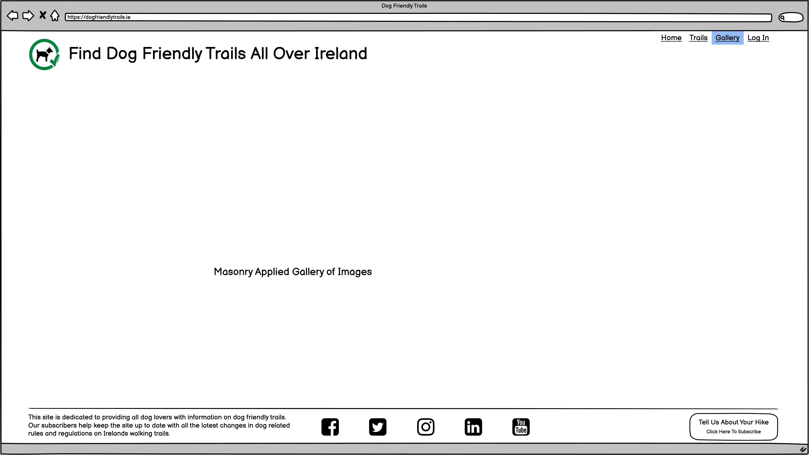

# Dog Friendly Trails

Dog Friendly Trails is a site that looks to keep up to date with the most recent rules and regulations with regard to dogs on Irish walking trails.

The site will be targetted at people who like to hike Irish walking trails encouraging them to bring their dogs with them on hikes. 

Dog Friendly Trails will be useful for these hikers by allowing them to plan for hikes by picking out trails that are most suitable for dogs.

Hikers are invited to subscribe to get access to all the verified dog friendly trails.

These verifications will be gathered by hikers submitting their experience with regard to dogs on trails they have hiked.

Note to me: Add images of app on various screen sizes

------

## Features

------

------

## UX/UI

### Site Goals

### Design Choices

### User Stories

### Wireframes

index.html                 |  trails.html
:-------------------------:|:-------------------------:
  |  

gallery.html               |  login.html
:-------------------------:|:-------------------------:
  |  

------

------

## Testing

------

------

## Deployment

------

------

## Deployment

------

------

## Credits

Flex Box Tuition thanks to w3schools and CSS Tricks

Multi Line CTA Button https://keenanpayne.com/css-multi-line-buttons/

Credit to w3schools for javascript tuition on submit and form validation on subscribe form

Credit to Jess Hines for Felbox Radio ideas https://codepen.io/thekrkn/pen/KzLXLw
------

------

## Future Features
-ms flex for IE10 and ensure compatibility with older browsers
Login Form and Password Reset
Streamline HTML structure
Improve css to be more efficient
I would consider learning and using Flex grid for complete site layout
Improve use of flexbox
Setup a CMS like structure for Trails complete with Search and Filter options
A popup subscribe instead of a subscribe page

------

------