# Dog Friendly Trails 

## Site Goals

Dog Friendly Trails is a site that looks to keep up to date with the most recent rules and regulations with regard to dogs on Irish walking trails.
The site will be targetted at people of all ages who like to hike Irish walking trails encouraging them to bring their dogs with them on hikes.      
 
Dog Friendly Trails will be useful for these hikers by allowing them to plan for hikes by picking out trails that are most suitable for dogs.
Hikers are invited to subscribe to get access to all the verified dog friendly trails. These verifications will be gathered by hikers submitting their experience with regard to dogs, on trails they have hiked.
 
 
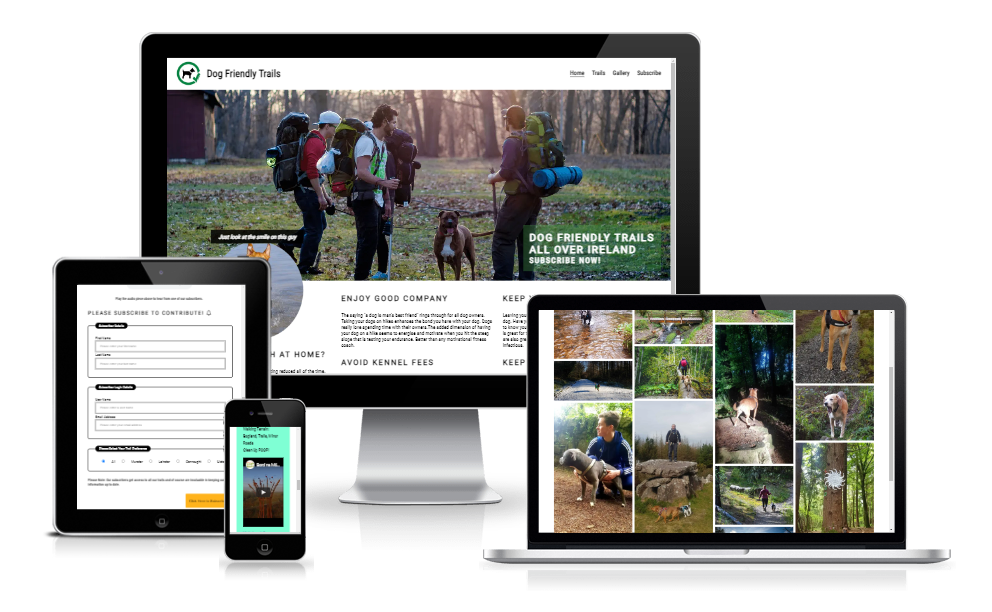

# UX/UI & Features

## Design Choices

- A four page website was a preferred minimum to satisfy the user requirement as opposed to a one page scroll.
- A simple colour scheme is preferred with lots of white space to present a modern no nonsense site which is uncluttered clear and inviting.
- The hero section is shared between the home page and the subscribe page. The hero image enhances the message "Bring your dog" and is eye catching and attracts the users attention on the home page and also nudges the user to commit to subscribe on the subscribe page.
- The ethos section encourages the users to find out more about dog friendly trails and why they should bring their dogs with them on hikes.
- The trails page provides the user with interesting information on 3 popular hikes that are dog friendly. This also gives the user an idea of what is available to them if they subscribe.
- The gallery page provides an interesting array of pictures with dogs enjoying trails. It is anticipated that users will identify with these images and see themselves with their dogs hiking interesting trails.
- The subscribe page is hopefully where users browsing the site will arrive at. There are CTA's in the index page and the footer leading them in that direction. Once there the subscribe form is simnple and clear for them navigate and fill in. 

## Site Navigation

- The Logo and the site desccription are featured in the top left corner. They both link to the top of the index page called Home.
- The navigation links to pages are situated to the right at the top of the page. The other pages are Trails, Gallery and Subscribe.
- The navigation links are in an attractive and visually clear websafe font which change color on hover to show a contrast.
- The navigation link that is active is underlined.
- The font color of the navigation clearly stands out against a white background.
- The navigation clearly shows a person browsing the site which page they are viewing and makes the site easy to browse through and find areas of interest.
- The navigation links switch to hamburger style on smaller devices.
- The logo switches to the right when the hamburger is displayed.

---- 

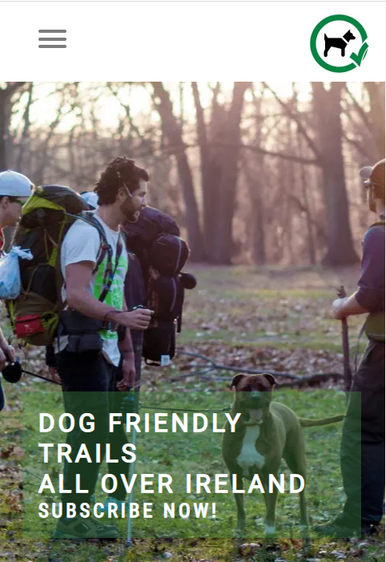  |  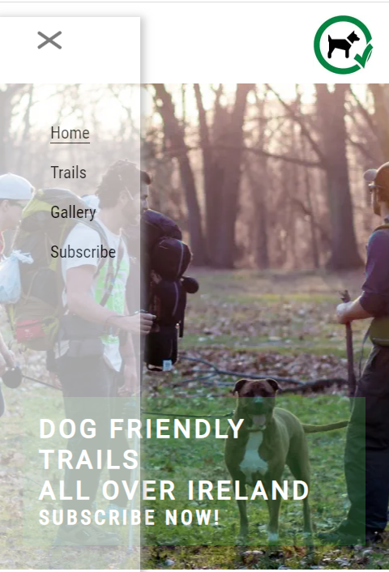

## Header

- The branding of the site is consistent as this is the common header used throughout the site and is situated at the top of every page.
- The color scheme is simple with black text on white background for contrast and clarity while the logo is also simple with a black dog symbol inside a green circle.
- As the header includes the navigation links this also retains a consistent experience for the person browsing the site. 
- The header tells the user the name of the site which is Dog Friendly Trails. This is a very self explanatory site description and thus makes for a very clear information about the site and who it is intended for.
- The logo is also very helpful in providing emphasis on a positive dog image.
----  

## Pages
 

### Index Page titled Home
 

Hero Section

- The hero section shows an attractive background image of hikers with a dog, this helps to cement the message of what the site is about.
- A CTA is included as a text overlay. This links to the subscribe page when clicked.
- The CTA has a background color with opacity which allows the image to show through and yet aid in reading clarity.
- The background color of the CTA also complements the green in the logo.  
- The image of the dog smiling with a header which belongs to the ethos section is pulled up into the hero section for added visual impact. 

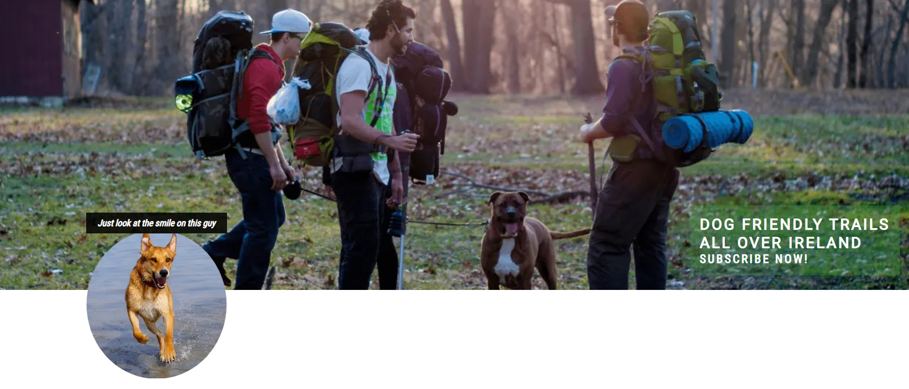
  
Ethos Section
 
The ethos section is displayed in 3 columns. These columns stack on smaller devices.

Left Column

- The left column shows the dog smiling image and the associated header which combined contain a positive emotional message.
- Below this is a challenge statement seeking to engage the user. 
- Below the challenge statement are some interesting fact statements. 

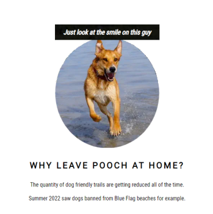

Center and Right Columns

- The center and right columns are laid out with 4 key Why? statements.
- These address the main reasons why it is important for users to consider bringing their dogs with them on hikes.

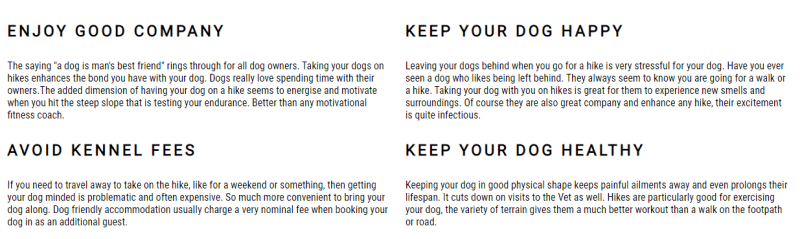
  

### Trails Page
 

Voted trails of the week

- This consists of 3 highlighted trails that are presented in 3 columns.
- These columns stack on smaller devices.
- Each column has a featured trail with details about that trail including a youtube video and a link to to an external site.

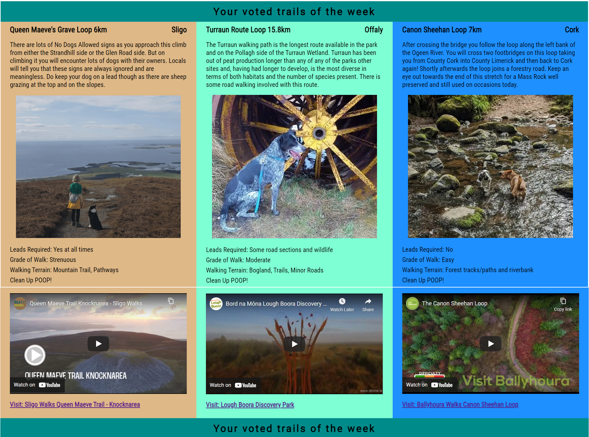
  

### Gallery Page
 

This contains images of dogs on hiking trails.

- This consists of images displayed in 4 columns in masonry format.
- The column count changes as devices get smaller.
- On mobile phones each image is displayed one above the other.
- Each image has a hover effect.
- Each image has a lightbox effect with navigation included in the lightbox display.

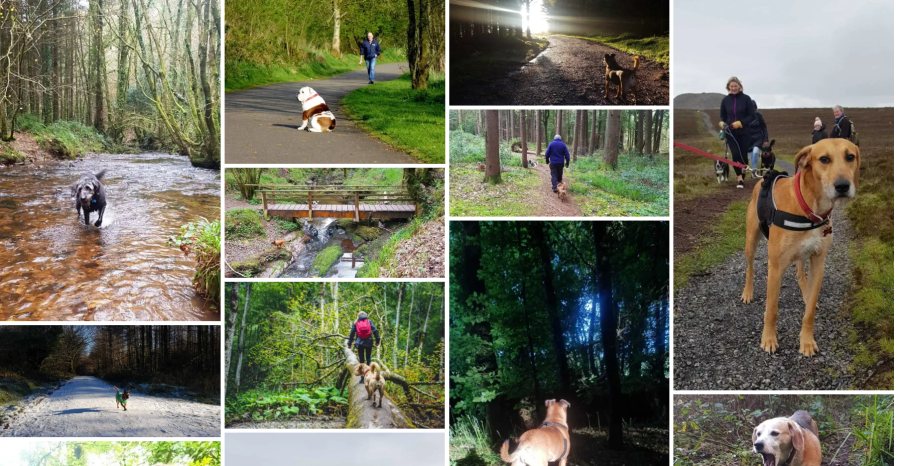
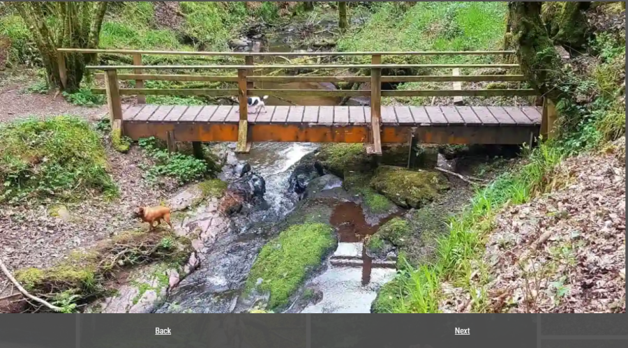
  

### Subscribe Page
 

This page is where a user can subscribe.

Hero Section

This is identical to the hero section on the index.html page. (Please see index page information above)

- This consists of 2 columns in 1/3 to 2/3 layout.
- The left column has similarities to the ethos left column. (Please see ethos left column on index page above)
- Below this is a challenge statement seeking to engage the user is an audio piece provided by a hiker.
- Below that is a headline inviting a user to listen to the audio.

- The right column has the subscription form.
- The form is laid out in 3 distinct areas:
    - Subscriber details
    - Subscriber Login Details
    - Trail Regional Preferences
- A subscribe button is clearly visible and it's background color draws a users attention to it.

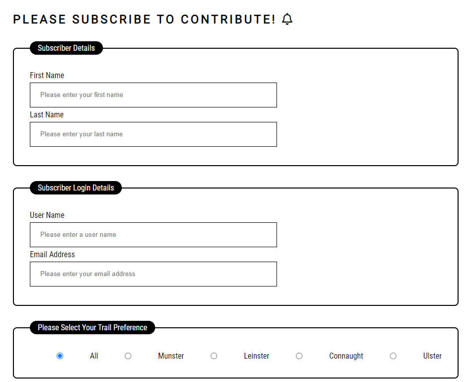

  

----

## Footer
 
The footer is used for all pages. However the subscribe page is slightly different in that the Subscribe button is omitted from the footer as it is used with the subscribe form.

The footer is displayed in 3 columns.

- The left column has an elevator pitch statement promoting the site.
- The middle column contains our social media icons. These link to external social media pages.
- The right column displays a subscribe button which links to the subscribe page.

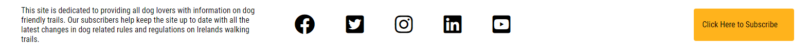

----

# Testing

Tests carried out by me.

- This site was tested by me to ensure that all of the pages on this site work in different browsers: Edge, Chrome, Safari and Firefox.
- I checked that the site works in responsive mode on all of these browsers.
- These tests were carried out on all pages of the site.
- The navigation works well on all browsers and the responsive hamburger works well on all browsers.
- The subscribe form works well and form validation works where required fields will not allow a bypass without valid entries. The email field will only accept a valid email structure and the submit button works as expected.

Validator Testing

- HTML:             All pages were passed through the official https://validator.w3.org/ and no errors were found.
- CSS:              All pages were passed through the official https://jigsaw.w3.org/css-validator/ and no errors were found.
- Accessibility:    By running the site through https://web.dev/measure/ and I got all results in the green.

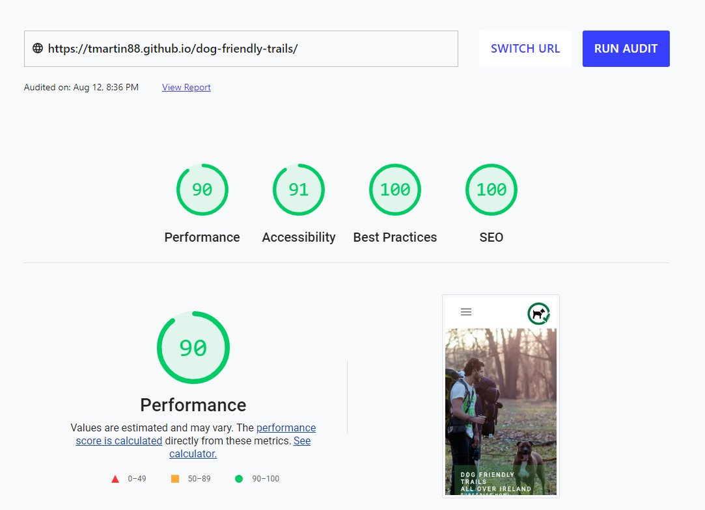
----

## Development Transition

### Initial Wireframe Concept

index.html                 |  trails.html
:-----------------:|:-----------------:
  |  

gallery.html               |  login.html
:-----------------:|:-----------------:
  |  

- July 12th I introduce a fancy multiline button with a pacman hover effect on Footer. See Credits for keenanpayne.com.
- July 14th I decide to remove the Login Form as I deem it confusing to include it at this point when I do not have a fully working login framework.
- So all login references become subscribe references.
- July 17th I am introduced to the world of flexbox. I decide to implement it on the site.
- This is an important development as it will have an impact on all my responsive development work yet to come.
- July 18th Use Javascript for Submit button and form validation. This is required because the button is not a regular submit button.
- July 21st I decide that Project1 should be free of Javascript and perform as CSS only
- So all javascript coding for the subscribe form are removed. 
- The Subscribe button which leans on javascript for its fancy multiline pacman styyle is now a regular submit button.
- This also applies to the Button in the footer.
- July 21st I decide to introduce a CSS only hamburger. I introduce this and it works fine. But this implementation fails the w3 html validator.
- I try a few others and same result. I naively decide to rollback to pre hamburger implementation attempts. 
- This does not go well but after some nervous work and assistance from Tutor support I get back to a good place.
- Lesson learned and an unexpected crash course in github.
- July 22nd I implement a CSS only hamburger. See Credits for alvarotrigo. This works well and does pass w3 html validator.
- July 24th I introduce CSS only lightbox. See Credits for veritygriscti

----

## Deployment

----

----

## Bug Fixes

July 12th I discovered a problem with the Readme file in that I could not get Wireframes in PDF format to work.
Fix 914854d So changed to images instead.

July 13th Due to a typo at the top of style.css which had a ripple effect of formatting issues further down the style.css document. I had various formatting problems that needed a tidy up.
Fix 00cfa73 Some css reformatting required.

July 14th Due to mistakes with relative path the site when viewed on github looked wrong with the hero image missing.
Fix 58ba9b4 Fixed relative path.

----

## Future Features
-ms flex for IE10 and ensure compatibility with older browsers
Login Form and Password Reset
Streamline HTML structure
Improve css to be more efficient
I would consider learning and using Flex grid for complete site layout
Improve use of flexbox
Setup a CMS like structure for Trails complete with Search and Filter options
A popup subscribe instead of a subscribe page

----
 
## Credits

### Content

- Credit to Keenan for Multi Line CTA Button https://keenanpayne.com/css-multi-line-buttons/. Actually I ended up throwing this out but I did keep the button colour.
- Credit to Jess Hines for Flexbox Radio ideas https://codepen.io/thekrkn/pen/KzLXLw
- Credit to w3schools for Flexbox Responsive Gallery https://www.w3schools.com/howto/howto_css_image_grid_responsive.asp
- Credit to Alvaro for css only hamburger https://codepen.io/alvarotrigo/pen/XWejzjR
- Credit to Verity for css only lightbox https://codepen.io/veritygriscti/pen/ExgjrOK

### Inspiration

- Credit to my great friends and companions, a Jack Russell called Luna and Buddha whose breed is unknown. "Happy trails"

### Instruction

- Flex Box Tuition thanks to w3schools and CSS Tricks
- Credit to w3schools for javascript tuition on submit and form validation on subscribe form. Actually I threw out all Javascript opting for a CSS only site.

### Media

- Thanks to my friend and hiking companion Ger Killilea for most of the photos.
- Pxhere.com for the hero image.
- Pexels for 4 of the gallery images boggyvalley, rockyriver, smallboyanddog and icyriver.
- Thank you to https://thecurvyhiker.wordpress.com/the-canine-companions/ for the Turraun Route Loop picture.
- Pixabay.com for Dog smiling image on ethos section.
- Knocknarea Trail image is thanks to Pete Houghton - Wordpress.com
- Ger Killilea for Audio piece on hiking.
- Trail Videos are from Youtube. 

----

